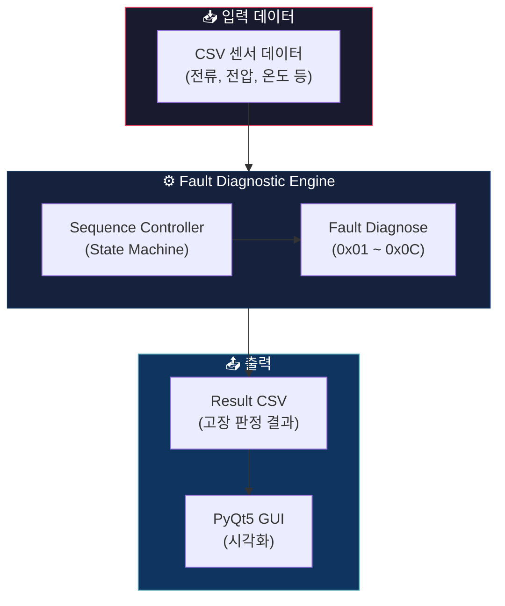
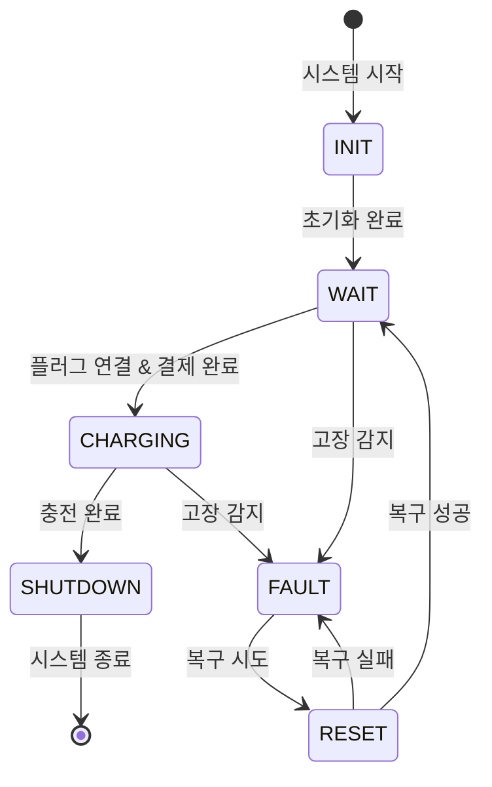

<div align="center">

# ⚡ OBC Fault Diagnostic System

### 전기차 충전기(OBC) 고장 진단 시스템

[](https://en.wikipedia.org/wiki/C_(programming_language))
[](https://isocpp.org/)
[](https://python.org/)
[](https://riverbankcomputing.com/software/pyqt/)

> 실무 데이터를 기반으로 OBC(On-Board Charger)의 고장을 자동 진단하고,
> PyQt GUI를 통해 결과를 시각화하는 임베디드 소프트웨어 프로젝트입니다.

---

</div>

## 📋 목차

- [프로젝트 개요](#-프로젝트-개요)
- [시스템 아키텍처](#-시스템-아키텍처)
- [고장 코드 목록](#-고장-코드-목록)
- [디렉터리 구조](#-디렉터리-구조)
- [충전 시퀀스 플로우](#-충전-시퀀스-플로우)
- [빌드 및 실행](#-빌드-및-실행)
- [팀 구성](#-팀-구성)

---

## 🔍 프로젝트 개요

**OBC(On-Board Charger)**는 전기차에 탑재되어 AC 전원을 DC로 변환하여 배터리를 충전하는 핵심 장치입니다.

본 프로젝트는 OBC 제어 시퀀스의 **고장 진단 로직**을 개발하고, CSV 기반 테스트 데이터로 검증하며, **PyQt5 GUI**를 통해 진단 결과를 시각적으로 확인할 수 있도록 구성하였습니다.

### 핵심 기능

| 기능 | 설명 |
|:---:|:---|
| 🔌 **충전 시퀀스 제어** | State Machine 기반 INIT → WAIT → CHARGING → SHUTDOWN 시퀀스 |
| 🩺 **12종 고장 진단** | 과전류, 저전류, 플러그, 릴레이, BMS 등 12개 고장 코드 자동 판정 |
| 📊 **결과 시각화** | PyQt5 기반 GUI로 CSV 입력/출력 및 고장 상태 시각화 |
| 🧪 **단위 테스트** | 각 고장 코드별 독립 테스트 케이스 지원 |

---

## 🏗 시스템 아키텍처



---

## 🚨 고장 코드 목록

| 코드 | 이름 | 설명 |
|:---:|:---|:---|
| `0x01` | **입력 과전류** (Input Overcurrent) | AC 입력 전류가 허용 범위를 초과 |
| `0x02` | **입력 저전류** (Input Undercurrent) | AC 입력 전류가 최소 기준 미달 |
| `0x03` | **플러그 이상** (Plug Fault) | 충전 플러그 연결 상태 이상 감지 |
| `0x04` | **릴레이 이상** (Relay Fault) | 메인 릴레이 피드백 불일치 |
| `0x05` | **BMS 상태 이상** (BMS State) | 배터리 관리 시스템 상태 이상 |
| `0x06` | **과온도** (Over Temperature) | 충전기 온도가 허용 범위 초과 |
| `0x07` | **CAN 통신 이상** (CAN Fault) | CAN 버스 통신 두절/오류 |
| `0x08` | **절연 이상** (Isolation Fault) | AC-DC 절연 저항 이상 감지 |
| `0x09` | **결제 이상** (Payment Fault) | 결제 시스템 연동 오류 |
| `0x0A` | **WDT 이상** (Watchdog Timer) | 워치독 타이머 미응답 |
| `0x0B` | **시퀀스 타임아웃** (Sequence Timeout) | 충전 시퀀스 진행 시간 초과 |
| `0x0C` | **온도 센서 이상** (Temp Sensor) | 온도 센서 단선/단락 |

> **고장 상태 3단계:** `NORMAL(0)` → `DETECT(1)` → `CONFIRM(2)`

---

## 📁 디렉터리 구조

```
aimakers/
├── 📄 README.md                  # 프로젝트 문서
├── 📄 sequence.cpp               # OBC 충전 시퀀스 상태머신 (교육용 레퍼런스)
├── 📄 02_02.md                   # 회의록
│
├── 📂 lhj/                       # 🧑‍💻 이현준 — Fault 진단 엔진
│   ├── fault.h                   #   고장 코드/상태/구조체 정의
│   ├── fault.c                   #   12종 고장 진단 로직 구현
│   ├── fault_test.c              #   단위 테스트 코드
│   ├── input.h / input.c         #   CSV 입력 파싱 모듈
│   ├── main.c                    #   진단 엔진 메인 (CLI)
│   ├── pyqt_ui.py                #   PyQt5 GUI (초기 버전)
│   ├── 📂 fault_log_data/        #   테스트용 고장 데이터 (CSV)
│   └── 📂 OBC_FAULT_LOGIC/       #   Visual Studio 프로젝트
│
├── 📂 htw/                       # 🧑‍💻 한태우 — 개별 고장 코드 개발
│   ├── 📂 code/                  #   고장별 진단 코드 (fault_no7.c, fault_no8.c)
│   └── 📂 data/                  #   테스트 데이터 (fault_no7.csv)
│
├── 📂 final/htw/                 # ✅ 최종 통합 버전
│   ├── 📂 code/                  #   통합 소스코드 + pyqt_ui.py (최종 GUI)
│   ├── 📂 data/                  #   검증용 데이터 (Fault1~4.csv)
│   └── 📂 exe/                   #   빌드된 실행 파일
│
└── 📂 obc_git/                   # 🔧 멀티파일 고장 감지기
    ├── multi_file_fault_detector.c
    └── run_analysis.bat          #   자동 실행 배치 스크립트
```

---

## 🔄 충전 시퀀스 플로우



---

## 🚀 빌드 및 실행

### 1. Fault 진단 엔진 (C)

```bash
# Visual Studio 프로젝트 빌드 또는 직접 컴파일
gcc -o fault_engine.exe lhj/main.c lhj/fault.c lhj/input.c -lm

# 실행
fault_engine.exe <input.csv> <result.csv>
```

### 2. 멀티파일 분석 (배치)

```bash
# obc_git 폴더에서 실행
cd obc_git
run_analysis.bat
```

### 3. PyQt5 GUI 실행

```bash
# 의존성 설치
pip install PyQt5

# GUI 실행 (최종 버전)
python final/htw/code/pyqt_ui.py
```

---

## 👥 팀 구성

<table>
  <tr>
    <td align="center">
      <strong>한태우 (htw)</strong><br/>
      개별 고장 코드 개발<br/>
      최종 통합 & PyQt GUI
    </td>
    <td align="center">
      <strong>이현준 (lhj)</strong><br/>
      Fault 진단 엔진 설계<br/>
      12종 고장 로직 구현
    </td>
  </tr>
</table>

---

<div align="center">

**AI Makers** · 실무 데이터 기반 ML/DL 모델 개발 팀

<sub>Made with ❤️ for EV Charging Safety</sub>

</div>
